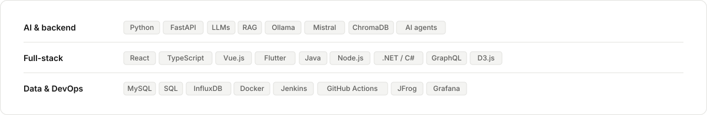
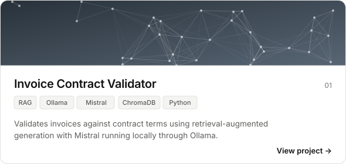
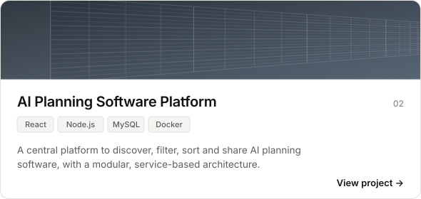
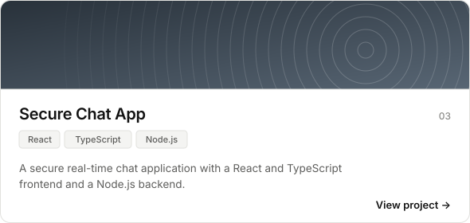
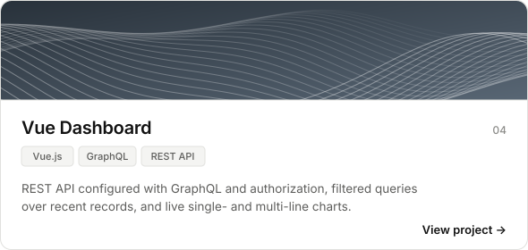

<!-- Profile README for github.com/imsaurabh1 : light and dark versions switch automatically -->

<picture><source media="(prefers-color-scheme: dark)" srcset="assets/hero-dark.svg"></picture>

 

<picture><source media="(prefers-color-scheme: dark)" srcset="assets/label-stack-dark.svg"></picture>

<picture><source media="(prefers-color-scheme: dark)" srcset="assets/stack-dark.svg"></picture>

 

<picture><source media="(prefers-color-scheme: dark)" srcset="assets/label-work-dark.svg"></picture>

<a href="https://github.com/imsaurabh1/invoice-contract-validator"><picture><source media="(prefers-color-scheme: dark)" srcset="assets/project-invoice-dark.svg"></picture></a>
<a href="https://github.com/imsaurabh1/MasterThesis_AIPlanningSoftwareRepository"><picture><source media="(prefers-color-scheme: dark)" srcset="assets/project-thesis-dark.svg"></picture></a>

<a href="https://github.com/imsaurabh1/secure_chat_app"><picture><source media="(prefers-color-scheme: dark)" srcset="assets/project-chat-dark.svg"></picture></a>
<a href="https://github.com/imsaurabh1/vue_api_graphql"><picture><source media="(prefers-color-scheme: dark)" srcset="assets/project-dashboard-dark.svg"></picture></a>

